# 🎨 Function Plotter

A Java-based application to visualize mathematical curves in **Cartesian** and **Polar (Radial)** coordinate systems. The app uses sliders for real-time control over parameters like **Amplitude (A)**, **Frequency (W)**, and **Phase Shift (PHI)**.

---

## 📷 Previews

### 📈 Cartesian Curves (`AppCartesian.java`)

| Curve Name            | Graph Preview                        | Formula Used                                  |
|----------------------|--------------------------------------|-----------------------------------------------|
| **Sine Wave**         | 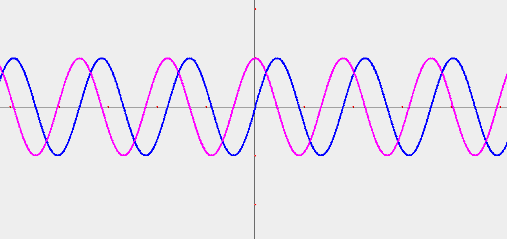       | `Math.sin(W * x + PHI) * A`                    |
| **Cosine Wave**       |      | `Math.cos(W * x + PHI) * A`                    |
| **Tangent Wave**      | 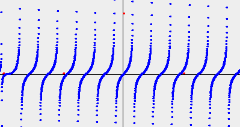        | `Math.tan(W * x + PHI) * A * 0.1`              |
| **Triangle Wave**     | 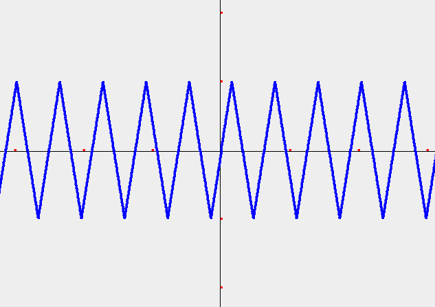 | `2 * A / π * asin(sin(W * x + PHI))`          |
| **Damped Sine**       | 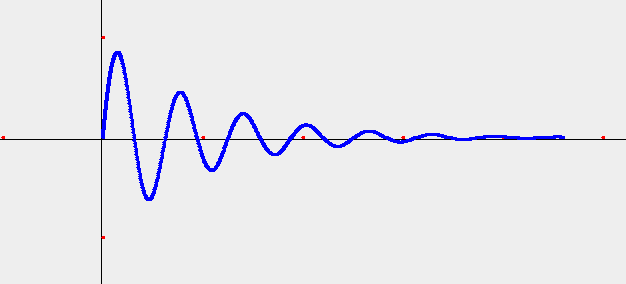     | `sin(W * x + PHI) * exp(-0.01 * x) * A`        |
| **Pulse Train**       | 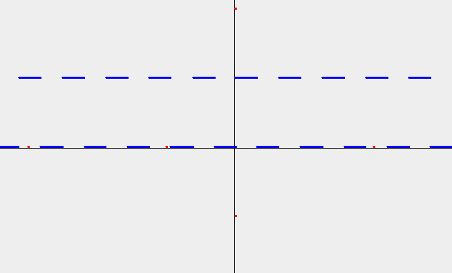      | `(sin(W * x + PHI) > 0 ? 1 : 0) * A`           |
| **Harmonic Blend**    | 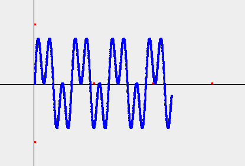| `(sin(W * x + PHI) + sin(3W * x + PHI)) / 2 * A`|
| **Sine of Sine**      | 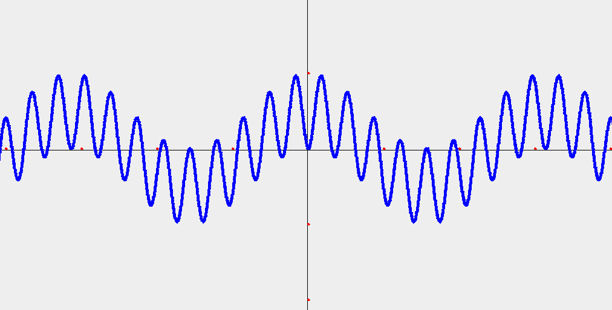| `sin(W * x + PHI) * sin(0.8W * x + PHI) * A`   |

---

### 🌀 Radial Curves (`AppRadial.java`)

| Curve Name             | Graph Preview                          | Formula (r = ...)                             |
|-----------------------|----------------------------------------|-----------------------------------------------|
| **Cardiod**           | 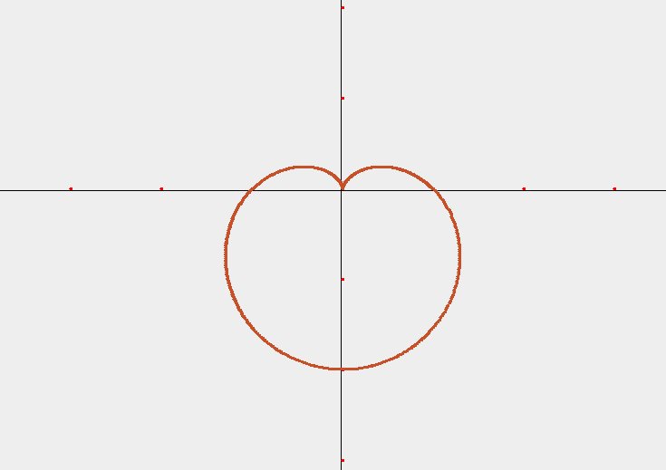           | `(1 - sin(θ)) * 100`                          |
| **Infinity (Lemniscate)**| 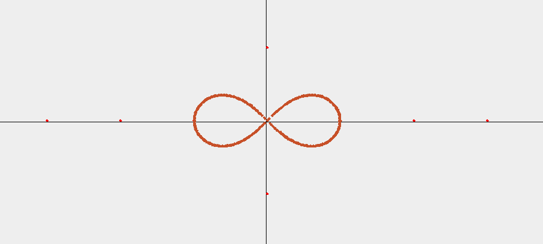     | `sqrt(10000 * cos(2θ))`                       |
| **Rose Curve**        | 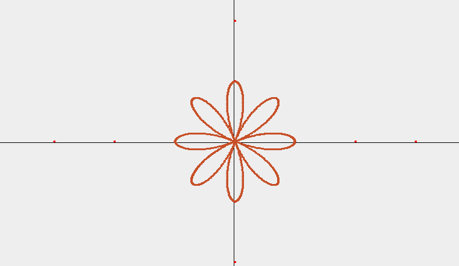               | `100 * cos(4θ)`                               |
| **Archimedean Spiral**| 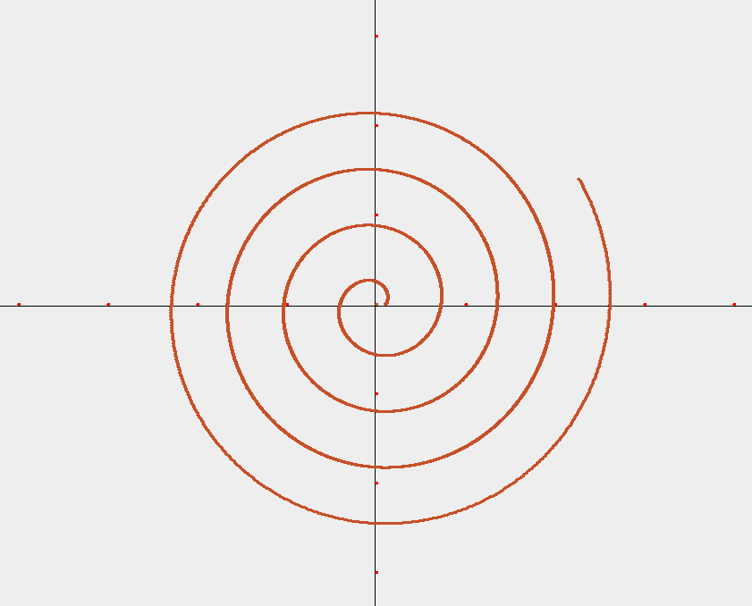 | `10 + 10 * θ`                                 |
| **Fermat Spiral**     | 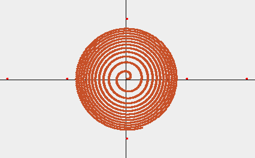           | `10 * sqrt(θ)`                                |
| **Epicycloid**        | 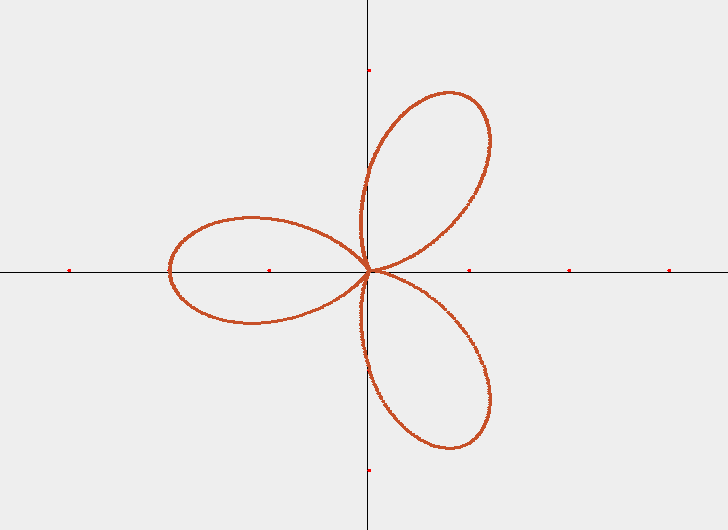   | `100 * (1 - cos(3θ))`                         |
| **Logarithmic Spiral**| 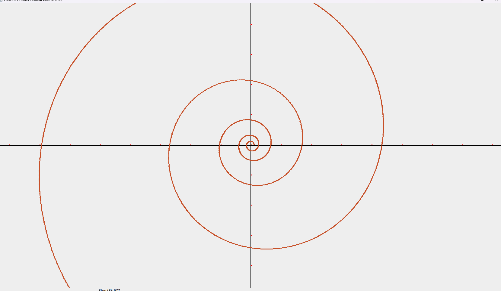                | `10 * e^(0.15 * θ)`                           |

---

## 🎛️ Controls

The app provides interactive **sliders** to dynamically update curves:

- **Amplitude (A):** Controls the wave height.
- **Phase (PHI):** Controls horizontal shift.
- **Frequency (W):** Controls wave compression/stretch.
- **Delay (D):** Time delay between redraws (animation speed).
- **Step (S):** How far `x` moves per frame.
---

### Example Usage in Code

```java
    int function(float x){
        A = sliderA.getValue();
        W = sliderW.getValue()/1000.0;
        PHI = sliderPHI.getValue()/100.0;
        return (int)(Math.sin(W * x + PHI) * A); // Sine Wave
    }

    public AppCartesian(){

        points = new ArrayList<>();
add ->  points.add(new Point((int)x,function(x),(int)size,Color.BLUE));
        new Timer(sliderDelay.getValue(), e -> {
            x += (float)(sliderStep.getValue()/10f);        
add ->      points.add(new Point((int)x,function(x),(int)size,Color.BLUE));
            repaint();
        }).start();
    }

```